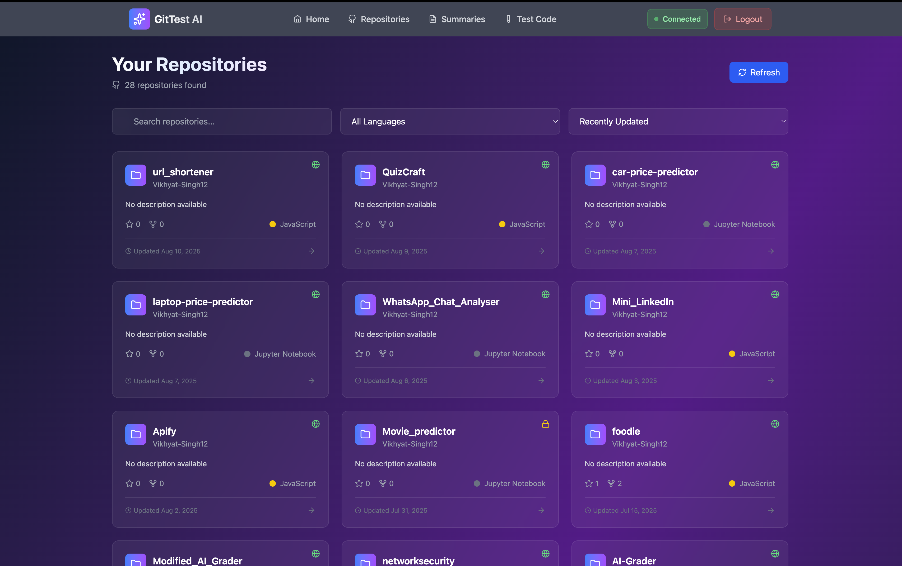
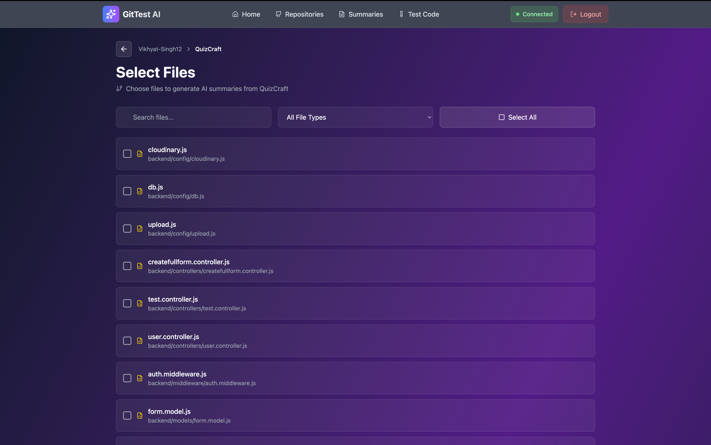
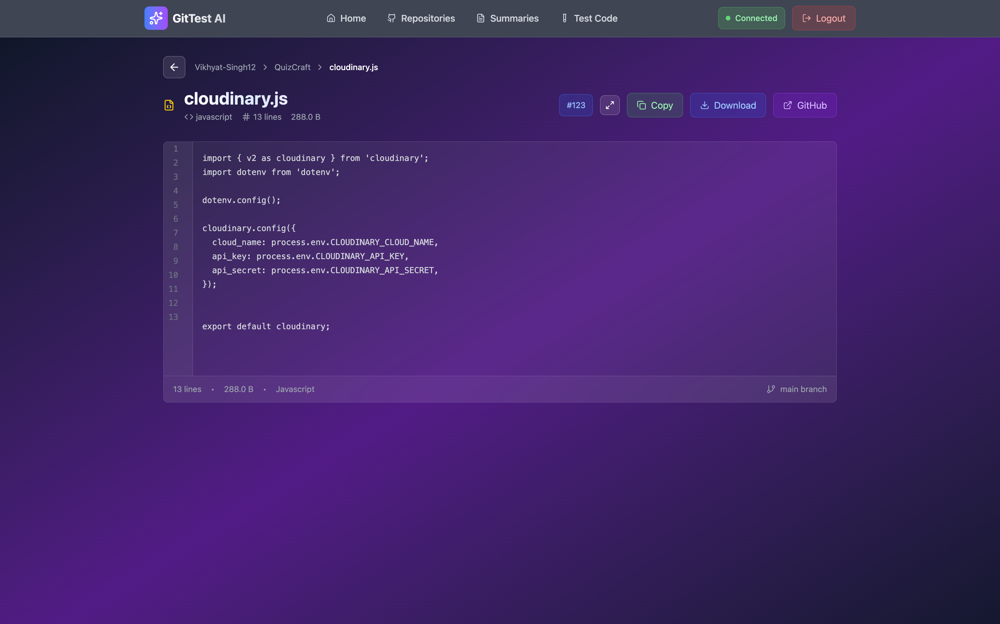
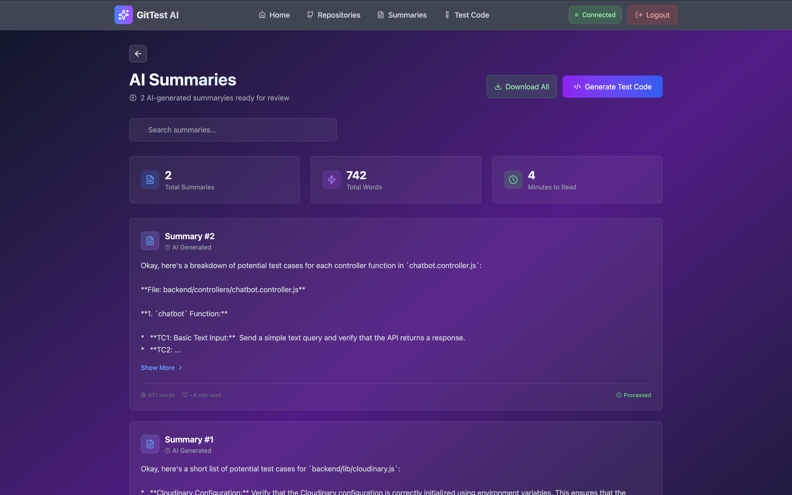
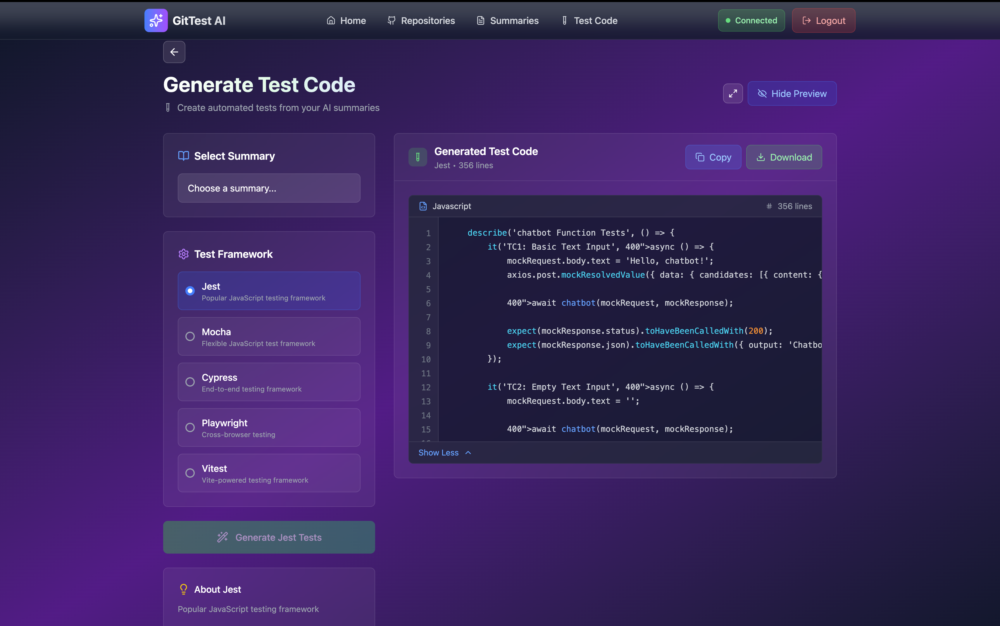

# 📂 GitHub File Explorer & AI Summarizer

A React + Node.js full-stack app to browse GitHub repositories, view files with syntax highlighting, and generate AI-powered summaries and test code snippets.

---

## 🚀 Live Demo

* **Frontend + Backend** [https://gittest-ai.onrender.com](https://gittest-ai.onrender.com)

  ⚠️ Server may take a few seconds to wake up after inactivity.

---

## 📦 Tech Stack

* **Frontend**: React (Vite) + TailwindCSS + Zustand for state management
* **Backend**: Node.js + Express
* **Authentication**: GitHub OAuth
* **AI Features**: OpenAI API integration for summaries and test code generation
* **Storage**: SessionStorage (for AI summaries persistence)
* **Hosting**: Your choice (Render, Vercel, etc.)

---

## 🛠️ Installation & Running Locally

### 1. Clone the repo

```bash
git clone https://github.com/your-username/github-file-explorer.git
cd github-file-explorer
```

### 2. Backend setup

```bash
npm install
npm run dev
```

Backend runs on `http://localhost:5000` by default.

Create a `.env` file in `backend/` with:

```
PORT=5001
GITHUB_CLIENT_ID=your_github_client_id
GITHUB_CLIENT_SECRET=your_github_client_secret
AI_API_KEY=your_openai_api_key
```

### 3. Frontend setup

Open another terminal:

```bash
cd frontend
npm install
npm run dev
```

Frontend runs on `http://localhost:5173`

---

## ✨ Features

* 🔐 GitHub OAuth for secure login and token management
* 📂 Browse user repositories and files with GitHub API
* 📄 View file content with syntax highlighting and line count
* 🧠 Generate AI-powered summaries of selected files
* 🧪 Generate test code snippets based on summaries
* 📋 Copy, download, and open files directly on GitHub
* 💾 Persistent storage of AI-generated summaries using sessionStorage
* ⚡ Mobile responsive UI with TailwindCSS

---


## 📸 Screenshots

| Repo List                               | File Selection                              | File Viewer                             | Summaries                                 | Test Code                               |
| --------------------------------------- | ------------------------------------------- | --------------------------------------- | ----------------------------------------- | --------------------------------------- |
|  |  |  |  |  |


---

## 🌟 Extra Features

* Session persistence of AI summaries so you don't lose data on refresh
* Copy and download file content directly from the UI
* Syntax highlighting and line numbering toggle for file viewer
* Clean and responsive design with mobile support

---

## 📬 Feedback & Contributions

Contributions and feedback are welcome! Open an issue or create a pull request for bugs, suggestions, or feature requests.

---

## 🔗 Useful Links

* [GitHub API Documentation](https://docs.github.com/en/rest)
* [OpenAI API Documentation](https://platform.openai.com/docs)
* [React](https://reactjs.org/)
* [TailwindCSS](https://tailwindcss.com/)
* [Zustand](https://zustand-demo.pmnd.rs/)

---

If you want, I can also help generate a `.gitignore` or deploy instructions for your chosen hosting platform!
